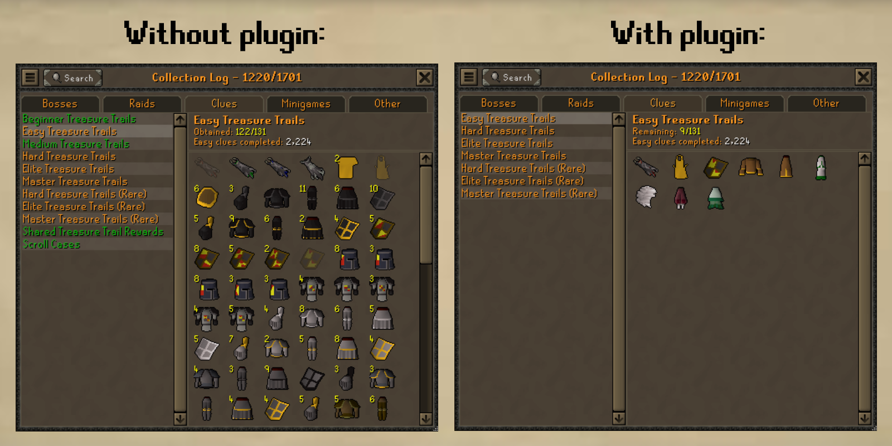

# Collection Log Hider

A RuneLite plugin for hiding obtained items and completed sections from the collection log.

## Known Issues

* If "Hide completed sections" is enabled and the first section in a tab is complete, then the plugin
  displays a blank page rather than navigating to the first incomplete section.